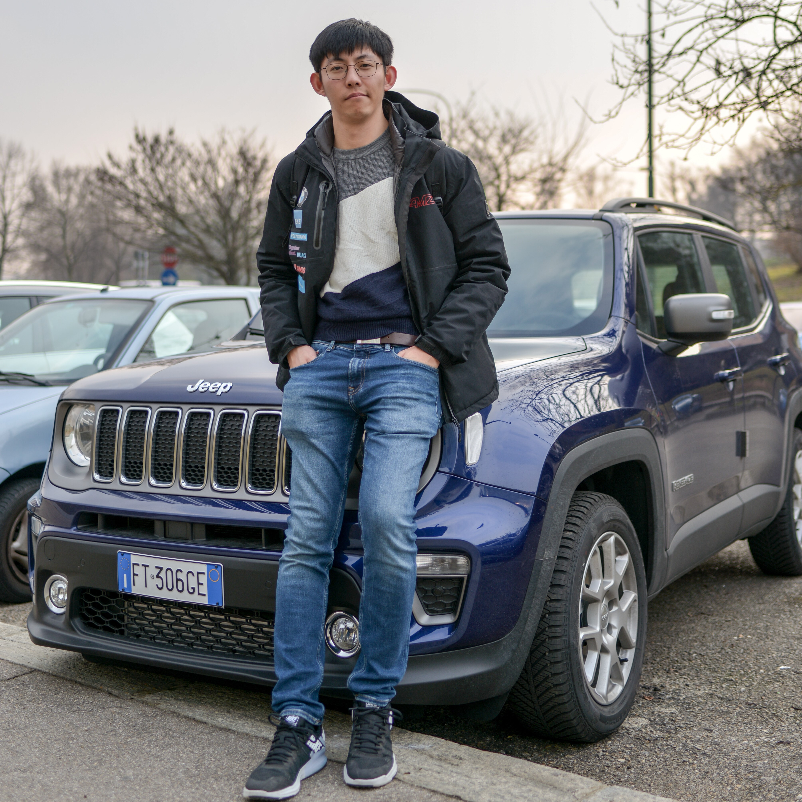

<!-- {:height="240px" width="240px"} -->
# **Kailin Huang**  

## About Me
Sensor Fusion Engineer at Fixposition AG. MSc Mechanical Engineering - Robotics from ETH Zürich. I have experience in Visual Localization and Mapping, GNSS, Sensor Fusion,  Pose-Graph Optimization, Extended Kalman Filter and Paricle Filter.

I was born in China and grew up there. I moved to Germany with my parents when I was 15. After finishing the German highschool (Abitur), I decided came to Switzerland to study mechanical engineering at ETH Zurich.

I speak Chinese, English and German fluently and can, after several years of struggle, also understand Swiss German. ;)

<!-- My detailed CV as PDF can be downloaded [here]({{site.cv | relative_url}}), last updated in March 2019. -->

## Projects & Experiences

### Industrial
* **Sensor Fusion / Software Engineer**
[Fixposition AG](https://www.fixposition.com/), Zurich, 06.2019 - now
  * Algorithm and software development of sensor-fusion pipeline
  * Developement of data analysis and visualization tools
  * Data analysis and customer support

* **Particle Filter for lane level localization**
Short Internship, Autonomous Driving Department, [NIO](https://www.nio.io/), Shanghai, 12.2018 - 01.2019
  Developing a particle filter to do sensor fusion from camera, GPS and IMU, in order to locate the car precisely inside the correct lane in  HD-Map.
* **CFD Methodology Development**
[MAHLE Behr GmbH](https://www.mahle.com/en/about-mahle/locations/6106.jsp), Stuttgart, 03.2016 - 09.2016
  * Programming Java-Tools for automation of STAR-CCM+ simulation workflow, post processing and report generation. Updating the code with updated APIs. 
  * Implementation of new functionalities and improved automation.
  * Creation of a cross-platform (Windows, Linux) Java-Tool for automated report generation from CFD simulation results and Excel table.

### Academic
* **[Dense Object SLAM](./projects/mt_objslam.md)**
Master Thesis, [Computer Vision and Geometry Group](http://www.cvg.ethz.ch/index.php), ETH Zürich, 03.2018 - 10.2018
Supervisor: Peidong Liu and Prof. Marc Pollefeys

  * Dense SLAM using RGB-D cameras with semantic instance segmentation using deep learning.
  * Using alignment of depth information to creat a 3D reconstruction of each object.
  * Objects can be used as landmarks for localization and loop closure.

    [Code](https://github.com/khuang93/MT_ObjSLAM), [Thesis](./resources/MT_ObjSLAM_LaTeX.pdf)

* **The role of Fluid Mechanics in Zebrafish Regeneration**
Semester Project, [CSE-Lab](https://www.cse-lab.ethz.ch/), ETH Zürich, 04.2017 - 07.2017
Supervisor: Dr. Siddhartha Verma

    * Coupled fluid-solid CFD simulation to understand the force on a zebra-fish's tailfin.

* **Feasibility study of an unsprung aerodynamic package in Formula Student**
Bachelor Thesis, ETH Zürich

* **Formula Student Electric**
ETH Zurich Student Project,  [AMZ Racing](http://www.amzracing.ch), 09.2013 - 09.2016
  Building a formula style race car in a team of about 25 people. Compete in Formula Student competitions (Formula Student [Germany](http://www.formulastudent.de) 
, [UK](http://www.imeche.org/events/formula-student/), [Austria](https://fsaustria.at/), [Spain](http://formulastudent.es/)) across Europe.
  * Design and development of steering system
  * Design, simulation, manufacturing of aerodynamics
  * Wind-tunnel testing and validation of aerodynamics
  * Mentor of aerodynamics

## Education
* **MSc. in Mechanical Engineering at [ETH Zürich](http://www.ethz.ch)**, 2016-2019
Focus in Robotics
  Courses:
  * Machine Learning
  * Probabilistic Artificial Intelligence
  * Image Analysis and Computer Vision
  * Dynamic Programming and Optimal Control
  * Recursive Estimation
  * Robot Dynamics
  * Theory of Robotics and Mechatronics
  * Vehicle Propulsion System
  * Flight Dynamics
  * Introduction to Game Theory
  * Fundamentals of CFD
  * Advanced CFD

* **BSc. in Mechanical Engineering at [ETH Zürich](http://www.ethz.ch)**, 2012-2016

    Courses:
    * Analysis I/II/III
    * Mechanics I/II/III
    * Linear Algebra
    * Chemistry
    * Machine Elements
    * Innovation Project
    * Control Systems I/II
    * Signals and Systems
    * Informatics
    * Computational Engineering
    * Manufacturing Techniques
    * Dimensioning I/II
    * Fluid Dynamics I/II
    * Thermodynamics I/II/III
    * Aerial and Ground Vehicle Aerodynamcis
    * Lightweight Construction

### More to come
My [technical blog](./blogs/blogs.md). Currently empty but will be filled with stuffs during the time.

## Contact
My Email is kailin-huang@outlook.com 

You are also welcome to follow me and message me on [LinkedIn](https://www.linkedin.com/in/kailinhuang93/) and [Github](https://github.com/khuang93). 
I am also a hobby photograph, follow [Instagram](https://www.instagram.com/khuang1993/) and [Shutterstock](https://www.shutterstock.com/g/Kailin+Huang) to see my photos.
